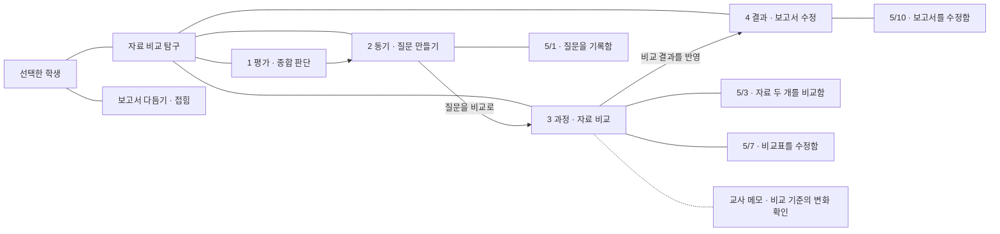

# 근거 지도: Manyfast 비교와 개선 설계

작성: 2026-09-12 · 갱신: 2026-09-13 · 상태: ADR-111 채택·로컬 구현, 배포 없음

이하 비교·수치는 9월 12일 설계 당시 기록이다. 구현과 검증 결과는 §12를 따른다.

## 1. 비교 범위와 근거

목표는 ‘근거를 정리한 결과가 노드·선·메모로 한눈에 읽히게’ 하는 것이다. 학급 운영과 수업 관리의 생기부 초안에 공통 적용한다. 디자인 원칙은 [DESIGN.md](../../../DESIGN.md)를 따른다.

| 근거                                                   | 이번 작업에서 확인한 범위                                                           | 한계                                                                               |
| ------------------------------------------------------ | ----------------------------------------------------------------------------------- | ---------------------------------------------------------------------------------- |
| 사용자 제공 Manyfast 이미지 3장                        | 가지형 배치, 넓은 작업 공간, 카드 위계, 곡선, 선택 강조, 보조 채팅 패널             | 실제 조작·저장 방식은 이미지로 증명하지 못함                                       |
| [Manyfast 공식 페이지](https://manyfast.io/ko/)        | 2026-09-12 공개 페이지 열람, 기획 산출물과 AI 작업 화면 소개                        | 로그인 편집기는 조작하지 않음. 첨부 이미지와 현재 제품 버전이 같다고 전제하지 않음 |
| 현재 쌤핀 소스                                         | 지도 배치 계산, 카드 표시, 장면·주제 연결, 메모 저장 필드, 두 맥락을 받는 공통 보드 | 이번에 실행한 Electron 화면 검증은 아님                                            |
| `tmp/e2e/map-scenelinks-1.png`, `map-scenelinks-2.png` | 저장되어 있던 1440×900 수업 관리 화면, 60% 축소·상세 패널 상태                      | 이전 실행의 이미지이며 이번 실행 캡처가 아님                                       |
| 기존 실행 기록·ADR-106~109                             | 장면 사이 화살표 결정, 장면 열 구현 경위, 이전 50% 맞춤 기록                        | 당시 테스트 통과를 이번 설계의 성공 근거로 쓰지 않음                               |

확인한 주요 소스:

- `src/adapters/components/RecordDraft/evidenceMapLayout.ts`
- `src/adapters/components/RecordDraft/EvidenceMapView.tsx`
- `src/adapters/components/RecordDraft/EvidenceMapNode.tsx`
- `src/adapters/components/RecordDraft/EvidenceMapSidePanel.tsx`
- `src/adapters/components/RecordDraft/RecordEvidenceBoard.tsx`
- `src/domain/entities/InquiryThread.ts`
- `src/adapters/hooks/useEvidenceMapPositions.ts`

## 2. 왜 아직 복잡하게 느껴지는가

현재 화면은 그래프 위에 **주제별 장면 표**를 그린 모습에 가깝다. Manyfast의 첨부 화면은 **부모에서 자식으로 가지가 펼쳐지는 지도**에 가깝다. 배경과 둥근 카드보다 이 차이가 크다.

| 비교 항목 | 현재 쌤핀에서 확인한 것                               | Manyfast 첨부 화면에서 보이는 것             | 개선 결정                                        |
| --------- | ----------------------------------------------------- | -------------------------------------------- | ------------------------------------------------ |
| 첫 시선   | 큰 앱 메뉴·수업 탭·기록 탭·근거 탭 아래 지도가 들어감 | 짧은 상단 바 아래 대부분이 지도              | 지도 진입 시 집중 공간, 상위 경로는 한 줄로 유지 |
| 정보 구조 | 주제 외곽 상자 안에 장면 열, 그 안에 같은 카드        | 주제→기능→세부 기능 가지와 크기 위계         | 학생→주제→장면→근거 가지형 배치                  |
| 폭        | 카드 224px, 열 간격 64px, 패딩 32px; 5열은 1,408px    | 가지별로 펼친 폭을 사용, 빈 영역은 여백      | 장면을 세로로 쌓고 근거를 오른쪽 가지로 연결     |
| 읽기 크기 | 저장 이미지에서 60%, 기존 기록에서 전체 맞춤 50%      | 선택한 카드가 충분히 큰 상태로 보임          | 글자 축소 대신 가지 접기·펼치기                  |
| 연결      | 열 머리 둘째 줄 화살표, 주제 사이 선은 왼쪽 가장자리  | 카드에서 직접 뻗는 곡선으로 부모·자식 인지   | 소속 곡선과 장면 순서 화살표를 구별              |
| 메모      | 장면·근거는 메모 아이콘, 본문은 상세에서 확인         | 첨부 자료만으로 독립 메모 기능은 확인 불가   | 메모 옆붙임은 쌤핀 요구에 맞춘 추가 설계         |
| 빈 상태   | 비어 있는 평가와 자리 미정도 열 크기를 차지           | 작은 추가 위치 표시                          | 빈 장면은 작은 노드, 자리 미정 0건은 감춤        |
| 상세      | 오른쪽 패널이 지도 폭을 줄임                          | 선택된 카드 강조, 보조 패널과 작업 대상 대응 | 보조 공간 하나, 열 때 선택 대상만 보이도록 이동  |

14px 본문을 60%로 그리면 약 8.4px이다. 더 작게 축소해서 전체가 들어가는 것은 ‘한눈에 이해’의 해결책이 아니다. 한편 Manyfast도 첨부 이미지에서 화면 바깥으로 가지가 이어지므로, 모든 내용이 무조건 한 화면에 들어간다고 해석하면 안 된다.

## 3. 추천 구조: 장면을 노드로, 근거를 가지로

학생과 주제는 왼쪽, 장면은 가운데 세로 방향, 각 장면의 근거는 오른쪽에 놓는다. 장면 순서는 위에서 아래로 읽는다. 근거끼리 이어 주는 화살표는 다시 만들지 않는다.

아래는 가상 자료를 사용한 구조도다. 실제 학생 기록이나 AI 생성 결과가 아니다. 화살촉 없는 선은 소속, 화살표는 장면 순서, 점선은 메모 부착을 뜻한다.

Mermaid는 관계 설명용이며 실제 좌표 계약은 다음과 같다. 선의 과밀을 막기 위해 주제→장면 곡선은 노드 왼쪽으로, 장면→근거 곡선은 오른쪽으로, 장면 순서 화살표는 장면 사이의 세로 여백으로만 지나간다.

### 3.1 화면 영역

- 상단 56px: `학급/수업반 > 생기부 초안 > 근거 정리`, 학생 전환, 영역 선택, 복귀.
- 다음 48px: `[+ 근거] [AI로 정리 제안]` / 오른쪽 `[근거 N건으로 초안 쓰기]`. 강조는 초안 버튼 하나.
- 나머지: 지도. 기존 전체 앱 메뉴·다중 탭은 집중 공간 뒤로 접고 복귀 시 이전 상태를 복원한다. 새 페이지로 학생 맥락을 다시 구성하지 않는다.
- 좌하단: 현재 범위·접힌 근거 수. 우하단: `전체 구조`·축소/확대. 자주 쓰지 않는 보기 전환·위치 초기화는 더 보기 메뉴.
- 상세 또는 AI 제안 패널은 오른쪽 하나만 사용한다. 기본은 닫힘. 폭 320px을 제안한다.

### 3.2 배치 예산

1440 화면 기준 첫 배치 제안: 외곽 24×2 + 학생 144 + 간격 48 + 주제 192 + 간격 48 + 장면 232 + 간격 48 + 근거 288 = **1,148px**. 남는 폭은 여백과 메모에 사용한다. 별도 메모 전용 열을 강제하지 않는다.

1280에서도 위 구조 폭은 들어간다. 오른쪽 320px 상세가 열릴 때는 모두를 줄이지 않고 학생·주제 쪽을 화면 밖으로 이동해 선택 장면과 근거를 유지한다. 경로는 상단에 남는다. 배율로 실제 가용 폭이 1,148px보다 작으면 학생 노드를 상단 경로로 합치고 근거 가지를 접는다.

장면 노드 높이는 기본 72~104px, 근거 72~112px로 제안한다. 메모가 있으면 36~56px 더 확보한다. 형제 장면 간 간격은 최소 24px이나 실제 높이는 펼친 근거와 메모가 차지하는 높이에 따라 계산한다. 숨긴 전체 본문 길이로 높이를 키우지 않는다.

## 4. 노드와 메모 표시 계약

| 종류 | 기본 겉면                                                    | 선택했을 때                         |
| ---- | ------------------------------------------------------------ | ----------------------------------- |
| 학생 | 이름·현재 영역, 주제 수                                      | 학생 변경은 상단 고르개 사용        |
| 주제 | 이름 2줄, 근거 수, 접기/펼치기                               | 주제 설정·메모·초안 범위            |
| 장면 | 순서 번호+역할, 교사가 붙인 이름 또는 기존 카테고리, 근거 수 | 역할·순서·근거 배치·메모 수정       |
| 근거 | 본문 앞 2줄, 날짜·출처, 필요한 상태만                        | 기존 근거 전문·원본 비교·메모       |
| 메모 | `교사 메모` 또는 `AI 제안`, 내용 2줄, 더 있는 표시           | 원래 소유 대상의 메모 입력으로 연결 |

- 본문을 임의로 AI 요약해서 새 제목으로 저장하지 않는다. 장면은 `label`이 있으면 우선, 없으면 기존 역할·카테고리를 사용한다.
- 장면 메모는 장면 바로 아래, 근거 메모는 근거 바로 아래 붙인다. 옆에 공간이 있으면 옆붙임으로 배치하되 소유 노드와 짧은 점선으로 연결한다.
- 메모를 새 독립 근거로 복제하지 않는다. 장면 `note`와 근거 `note`는 기존 저장 필드를 그대로 편집한다.
- 주제 `nextNotes`는 ‘다음 탐구 메모’로 표시한다. 일반 메모라는 새 저장 필드를 임의로 만들지 않는다.
- `leadIn`은 이전 장면에서 오는 화살표 옆 최대 2줄. 비어 있으면 선만 그리고, 선택/포커스 때만 `이음말 추가`를 보인다.
- AI 출처를 가진 장면 메모는 `noteSource`를 반영한다. 작성자가 확인되지 않은 메모에 AI/교사 출처를 새로 추정하지 않는다.
- 메모는 기본 가시화하되 가지가 접혀 있으면 `메모 N개` 표시를 남긴다. 개요에서 모든 메모 전문을 노출하지 않는다.
- 기존 색점 4종은 작은 역할 표시로만 유지하고 장면 전체를 4색 면으로 채우지 않는다. 근거·메모는 sp-\* 토큰을 사용한다.

## 5. 선의 의미

| 선                    | 의미                                  | 저장 영향                                                    |
| --------------------- | ------------------------------------- | ------------------------------------------------------------ |
| 화살촉 없는 얇은 곡선 | 이 주제의 장면, 이 장면에 포함된 근거 | 기존 소유·배치의 표시. 선을 그리는 행위로 새 관계 저장 안 함 |
| 방향 있는 선+이음말   | 앞 장면→다음 장면의 작성 흐름         | 기존 scenes 순서와 leadIn 사용                               |
| 주제 간 방향선        | 이어진 주제                           | 기존 linkFrom 사용. 존재하지 않는 성장 관계 추론 금지        |
| 짧은 점선+메모 표시   | 해당 노드에 붙은 메모                 | 기존 note/nextNotes 사용                                     |

선은 노드나 글자를 통과하지 않는다. 선택한 장면의 소속 선·앞뒤 화살표만 강조한다. 비선택 선은 약하게 하되 사라지지 않는다. AI 제안은 점선만으로 구분하면 메모와 혼동되므로 `제안` 배지와 외곽선을 함께 사용한다.

현재 ADR-108의 ‘근거 사이 화살표 없음’을 유지한다. 이 설계에서 근거에 붙는 무방향 선은 **소속 표시**이며 임의 연결 기능의 재도입이 아니다.

## 6. 한눈에 보기와 많은 자료

‘한눈에’의 범위는 **전체 묶음 구조와 현재 살피는 주제의 근거·메모**다. 수백 건 전문을 같은 화면에 넣는 것을 목표로 삼지 않는다.

1. 첫 진입: 모든 주제의 제목·건수를 배치하고 저장된 순서의 첫 주제를 펼친다. 기존 복귀 위치가 있으면 그 주제를 유지한다.
2. 펼친 주제: 장면은 모두 표시. 장면당 근거 앞 2건을 기존 순서대로 표시하고 나머지는 `근거 N건 더 보기`로 묶는다. ‘대표 근거’라고 부르지 않는다.
3. 이미 저장된 펼침 상태는 학생·수업반·영역별로 복원한다. 처음부터 매번 접지 않는다.
4. `전체 구조`: 자동 축소를 반복하지 않고 근거 가지를 임시로 접어 주제·장면·연결을 보여 준다. 누르기 전의 펼침·확대 상태로 돌아갈 수 있어야 한다.
5. 근거 1~8건은 가능하면 전부 펼쳐도 읽히게 배치한다. 20·50·200건은 주제별 접기로 접근하며 숨겨진 수를 표시한다.
6. 20개 장면 상한까지 지원한다. 세로 이동은 허용하고 현재 주제 이름을 상단에 유지한다. 여러 주제의 모든 장면을 동시에 1화면으로 축소하지 않는다.
7. 빈 평가 장면은 `평가 · 근거 전체를 종합` 작은 노드로 유지한다. ADR-109의 요청서 규칙은 그대로다. 다른 빈 장면은 작은 역할 노드로, 자리 미정은 0건이면 감추고 N건이면 주제 아래 독립 가지로 표시한다.
8. 장면 없는 주제는 기존 날짜순 근거를 오른쪽으로 펼친다. AI 실행이나 틀 만들기를 강제하지 않는다.

접기는 표시만 바꾼다. 초안에서 근거를 제외하거나 순서를 바꾸지 않는다.

## 7. 조작 흐름

### 결과 확인 → 수정 → 초안

1. 같은 학생·영역으로 지도 진입.
2. 주제 가지에서 근거와 메모 확인. 근거 한 번 클릭은 **상세 열기**만 한다.
3. 상세의 `초안에 사용할 근거 고르기` 또는 선택 시작 메뉴로 다중 선택한다. 체크 표시와 `선택 해제`를 보이며, 일반 클릭과 초안 범위 변경을 혼동하지 않게 한다.
4. 장면 이름이나 메모를 누르면 같은 보조 패널에서 편집한다. 지도에는 선택한 대상과 주변 관계가 남는다.
5. 초안 버튼은 선택이 없으면 기존 포함 규칙의 전체 근거, 선택이 있으면 `고른 근거 N건으로 초안 쓰기`. 제외 M건도 생성 전에 확인 가능해야 한다.
6. 초안에서 돌아오면 학생·영역·주제 펼침·화면 위치를 복원한다. 미분류 근거가 있어도 초안 작성은 가능하다.

### 끌기와 순서

- 지도 빈 곳 끌기/Space+끌기는 화면 이동. 휠은 이동, 확대는 기존 명시적 버튼 및 Ctrl+휠을 제안한다.
- 근거를 다른 장면에 놓을 때 대상 이름·삽입 위치를 먼저 표시한다. 놓으면 기존 배치 저장 관문을 호출하고 되돌리기를 제공한다.
- 같은 장면 안 근거 순서는 삽입선으로 바꾼다. 키보드는 상세의 위/아래 이동으로 같은 결과를 만든다.
- 장면 자체는 상세의 앞/뒤 이동으로 변경한다. 자유 위치 이동과 초안 순서 변경을 혼합하지 않는다.
- 다른 주제로 이동은 주제 소유도 바뀜을 놓기 전에 표시한다. 저장 실패 때 원래 위치·선택·메모를 유지한다.
- 메모 붙임 위치 조정은 기기별 표시 설정이다. 메모 내용이나 초안 순서를 바꾸지 않는다.

### AI 제안

- 현재 지도 위에 변경될 주제·장면만 제안 표시. 원본은 유지한다.
- 보조 공간에서 추가·이동·메모 변경 수와 적용 범위를 확인한다.
- `적용` 전 저장 0회. 무시는 원상 유지. 적용 실패 시 제안과 입력을 남겨 재시도한다.
- 학생 전환 뒤 도착한 응답이 다음 학생 화면에 붙지 않는다. 현재 주제만 변경할 때 다른 가지를 재배치하지 않는다.
- 이번 제안은 AI 모델·요청서 정책 변경을 요구하지 않는다.

## 8. 유지할 것과 바꿀 것

유지: 두 진입 경로, 저장된 주제 소유, 장면 차례, 근거 차례, 근거 원본과 비교, AI 적용 승인, 초안 제외 설정, 상단 주요 작업 3개, 보조 공간 하나.

변경: 장면을 가로 열에서 세로 노드로, 근거를 소속 가지로, 메모 아이콘을 내용 미리보기로, 기본 작업 공간을 집중 공간으로, 맞춤 동작을 읽기 가능한 구조 조망으로.

ADR-107의 가로축=장면 순서는 이 제안에서 세로축=장면 순서로 바뀐다. ADR-108의 장면 간 화살표와 ADR-109의 빈 평가 규칙은 유지한다. **아직 채택 ADR을 새로 만들지 않는다.** 기존 결정을 이미 변경된 사실처럼 기록하지 않는다.

## 9. 구현 인계 순서

| 단계        | 범위                                                            | 통과 기준                                   |
| ----------- | --------------------------------------------------------------- | ------------------------------------------- |
| 0 기준선    | 두 맥락의 합성 학생, 현재 일반·확대·상세 캡처 및 저장 구조 기록 | 기존 자료를 손대지 않고 현재 계약 확인      |
| 1 배치      | evidenceMapLayout·EvidenceMapView의 주제/장면/근거 가지, 접기   | 순서·소유 변경 0, 노드·선 충돌 없음         |
| 2 카드·메모 | EvidenceMapNode 및 장면 겉면, 메모 미리보기                     | 전문 보존, 동일 필드 편집, AI 출처 유지     |
| 3 공간·조작 | RecordEvidenceBoard·SidePanel의 집중 공간, 클릭/선택 구분, 복귀 | 맥락 보존, 초안 범위 명료, 미저장 입력 보존 |
| 4 검증      | 두 경로, 세 해상도·배율·테마, 대량 근거, 실패 처리              | 아래 수용 기준 및 네 게이트 모두 통과       |

구현은 순차 수행한다. 새 그래프 라이브러리 도입은 필수 조건이 아니다. 현재 SVG+React 구조로 배치·접기 요구를 충족하는지 먼저 검증하고 성능·접근성 문제의 증거가 있을 때만 별도 판단한다.

표시 설정 키에는 학생뿐 아니라 학급/수업반·영역·배치 버전을 포함한다. 이전 가로 열의 오프셋을 새 가지 배치에 그대로 적용하지 않는다. 기존 설정을 삭제하지 않고 새 버전 표시 설정으로 분리하여 되돌릴 수 있게 한다.

`RecordEvidence.threadId`가 주제 소유의 기준이다. `scenes[].evidenceIds`는 순서와 배치이며 없는 근거를 생성하지 않는다. 데이터 수집·중복 방지는 기존 collectEvidenceCandidates/evidenceImport 경계를 사용한다. 잔존 `links`와 요청서 분기는 이번 표시 개선에 섞어 삭제하지 않는다.

## 10. 수용 기준과 실패 시나리오

아래는 **향후 검증할 기준**이며 이번 작업의 통과 결과가 아니다.

- AC-01: 학급 운영/수업 관리 각각 다른 학생·영역에서 진입·복귀해 학생, 영역, 주제, 화면 위치가 동일하다.
- AC-02: 1440×900·1280×800에서 첫 주제 4장면·8근거를 표시할 때 제목·본문의 화면상 크기 14px 이상을 유지한다. 공간이 부족하면 접힌 개수와 펼치기 경로를 제공한다.
- AC-03: 1920×1080 및 Windows 배율 125/150%에서도 잘린 버튼, 접근 불가능한 근거가 없다. 일반·집중 보기 모두 확인한다.
- AC-04: 선은 카드·메모·라벨을 통과하지 않는다. 긴 제목과 이음말 200자, 메모 200자에서 원문 손실 없이 더보기로 접근한다.
- AC-05: 장면 메모와 근거 메모가 같은 값일 때도 각각 올바른 대상에 저장된다. AI 메모 출처가 유지된다.
- AC-06: 빈 평가, 다른 빈 장면, 자리 미정 0/N건, 장면 없는 주제, 마친 주제를 각각 읽고 이해할 수 있다.
- AC-07: 클릭은 상세만 열며 초안 선택 수가 바뀌지 않는다. 별도 선택·제외·초안 전환 결과의 ID 집합이 요청서와 일치한다.
- AC-08: 접기·확대·전체 구조·화면 이동은 근거/주제 파일 저장 0회, 요청서 변경 0이다.
- AC-09: 장면/근거 순서 변경은 화면·저장·초안 요청서가 같은 순서다. 메모 위치 변경은 순서를 바꾸지 않는다.
- AC-10: AI 적용 전 저장 0회, 적용 실패·취소·학생 전환 후 늦은 응답에서 자료가 바뀌지 않는다.
- AC-11: 저장 실패 때 편집 글과 선택 상태를 유지한다. Esc는 입력 상태를 처리한 뒤 보조 공간, 그다음 집중 공간 순으로 닫는다.
- AC-12: 0/1/8/20/50/200근거, 1/5/20장면, 주제 1/3/10개로 부하를 측정한다. 200근거 접힌 초기 화면과 선택 반응 시간 p95를 기록하고 목표 200ms 초과 시 병목을 해결한다. 목표 수치는 측정 전 제안값이다.
- AC-13: 밝음·어두움·유리 모드에서 본문과 메모를 읽을 수 있고 선택·제외·제안 상태를 색 없이 구분한다.
- AC-14: 키보드로 상세 열기·메모 수정·근거 배치·순서 변경·초안 선택·복귀가 가능하다.
- AC-15: 교사 3~5명에게 ‘이 근거의 장면’, ‘이 장면의 메모’, ‘다음 장면으로 이어지는 이유’를 찾게 한다. 첫 화면 10초 내 주제·흐름 파악을 목표로 관찰하고 실패하면 배치를 재검토한다. 아직 사용자 시험을 하지 않았다.

구현 검증 명령: `npx tsc --noEmit`, `npm run lint`, `npm run test`, `npm run regression-check`. 공개 가이드가 실제로 바뀌는 구현 시 `landing/src/content/docs.ts`와 필요한 화면 이미지를 갱신하고 `cd landing && npm run docs:check && npm run build`를 실행한다.

## 11. 이번 설계에서 확인한 것

- 현재 소스와 저장된 화면 이미지에서 가로 열·축소·메모 숨김 문제를 확인했다.
- 공식 페이지를 열람하고 사용자 첨부 이미지 3장을 기준으로 시각적 차이를 비교했다.
- 설계 문서의 경로·섹션·변경 범위를 검사한다. 앱 코드를 바꾸지 않았으므로 제품 구현 완료나 개선 효과 검증을 주장하지 않는다.
- 새 Electron 실행, 새 브라우저 캡처, 라이브 AI, 교사 사용성 시험, 전체 개발 게이트는 이번 설계 작업에서 실행하지 않았다.

## 12. 승인 후 구현과 검증 (2026-09-13)

[ADR-111](../../03-decisions/ADR-111.md)에 따라 가지 배치·메모 표시·상세/초안 선택 분리·넓은 작업 공간·근거 삽입 순서·메모 보존·장면 삭제 및 AI 적용 되돌리기를 구현했다. 추가 요청에 따라 AI 요청서에 교사 맥락과 근거에 입각한 관계 규칙을 보강하고 관계 이음말을 별도로 받는다.

네 개발 게이트와 브라우저 두 경로, 실제 드래그·저장값 readback, 가상 자료 실제 AI 응답 1건을 확인했다. 상세 실행 수치와 스크린샷은 [월별 기록](../../progress/2026-09.md)을 따른다.

설계의 모든 AC가 실측 통과했다는 뜻은 아니다. 교사 사용성, 200근거 성능 p95, 패키징된 Electron의 배율 시험은 미실행이다. 메모는 해당 장면·근거 옆에 붙이며 독립 자유 좌표 메모, Ctrl+휠/Space 전용 조작, 그래프 위 변경 차이 중첩은 이번 구현에 포함하지 않는다.
